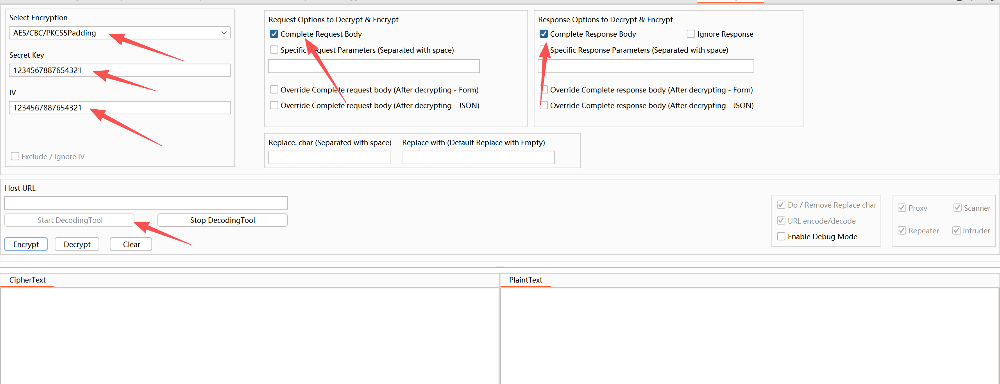
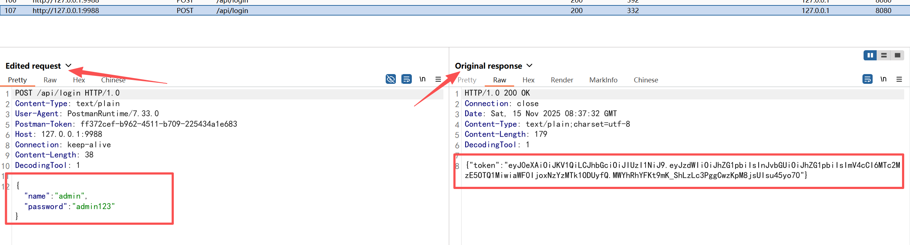
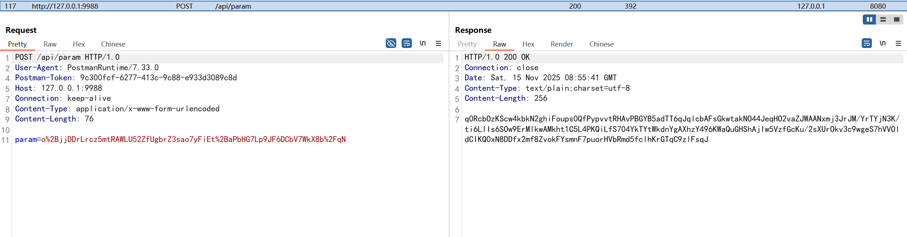

# 1、介绍
在日常渗透时，发现很多系统（Web/App/小程序等）在与服务器进行通信时，为了保证数据的安全，往往会对传递的数据进行加密、签名来保证数据传递的机密性和完整性。这给渗透工作带来了不小的麻烦，在之前一般都是
通过js逆向分析定位到相关加解密函数之后，然后在前端手动调用加解密函数进行测试，但是这样效率极低；渗透测试往往需要集中精力的去观察系统传递的每一个参数是否存在问题，但是由于每次都需要手动修改数据->
前端加密->burp在发送到服务器，这样会导致注意力分散而不利于工作。

目前对于对抗前端加密的项目在GitHub上确实有一些相当的不错，比如：
- JS-RPC
- JS-forward
- ……

但对于我自己来说我可能需要的不仅仅是一个能做加解密功能，我希望它是一个即能加解密又能解各种编码（常见的URL编码、Base64编码等）、签名自动生成的项目。

DecodingTool最初是AESKiller的二开项目，使用该项目作为而开是当时觉得该项目的UI看起来比较好看，且实现的功能点与我预期的相符合，使用该项目刚好可以借用其好看的UI快速完成开发，在此感谢d3vilbug师傅开源项目。

为什么要进行二开？经过大量的实战发现，该工具其实使用的返回很是有限，首先只支持AES加解密，且其中的加密类型、填充方式也很有限，在这样的场景下为了更好的将该工具的功能使用最大化，于是对项目进行了重构，不在仅限于各类加解密，而且也支持各类编码、签名等。

# 2、工具使用

工具界面如下，日常在使用时，如果遇到前端加密为经典的AES加密，那么我们首先在Select Encryption下拉框选择对应的加密方式，然后填入KEY/IV（可为空），再配置Request Option和Response Option，配置好之后点击Start DecodingTool即可开始解密数据包。

比如发现一个网站是AES/CBC/PKCS5Padding方式进行加密，下面进行演示不同类型的加密场景。

## 2.1、整个请求体和响应体

burp截图如下：

那么这时我们的配置如下：

然后再次请求网址时，在burp中进行展示时，其中的明文已经被解码为明文。

## 2.1、请求参数

请求参数，即在http请求中只是针对其中的某个参数进行加密，如下：

使用该工具需要具备什么样的条件基础？目前工具已经内置了AES/URL/BASE64等比较常见的数据编码：

- 如果你是脚本小子，不具备JS逆向和Java代码编写的基础，那么可以内置功能即可，目前工具已经内置一下功能：
    - AES/CBC/NoPadding
    - AES/CBC/PKCS5Padding
    - AES/CBC/PKCS7Padding
    - AES/ECB/NoPadding
    - AES/ECB/PKCS5Padding
    - AES/ECB/PKCS7Padding
    - AES/OFB/NoPadding
    - BASE64_DEncode
    - URL_DEncode
- 如果你具备JS逆向和Java代码编写基础，那么你将会最大化发挥工具的价值，工具支持自定义加解密逻辑，通过如下步骤实现自定义加解密逻辑：
    
    1. 在burp.strategy.impl包下面定义你自己加解密策略，同时该类需要实现burp.strategy.CipherStrategyFactory接口，然后在其对应的函数中自定义加解密逻辑即可；
    
    2. 在burp.common.Constant常量中定义你自己的策略常量，跟代码中已有的常量格式保存类似即可；
    
    3. 在burp.strategy.InitCipherStrategy类的静态代码块中放入你的加解密策略，其中静态常量Map的key为上述你自己的常量，value为你自己自定义的加解密策略；
    
    4. 然后重新编码打包即可。

# 3、进阶使用

目前DecodingTool项目依然保留着AesKiller项目的设计理念。即通过对ProcessHttpMessage与ProcessProxyMessage方法的重写使得加密的数据从浏览器进入burp时，在burp展示为明文；从burp到服务器时，又会自动
加密为密文，原理大致如下：

